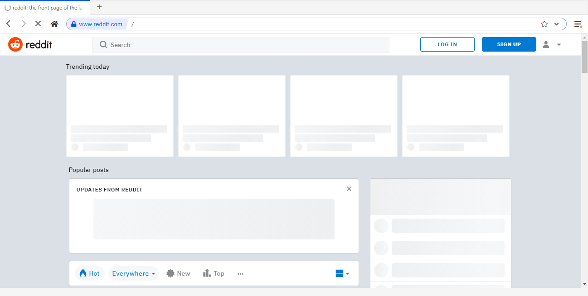

Broxme Browser A Hackable Peer To Peer Web Browser
======




Broxme is a hackable peer-to-peer Web browser with build in adblocker. It adds new APIs for building hostless applications while remaining compatible with the rest of the Web. 

Please feel free to open usability issues.


## Table of Contents

<!-- START doctoc generated TOC please keep comment here to allow auto update -->
<!-- DON'T EDIT THIS SECTION, INSTEAD RE-RUN doctoc TO UPDATE -->


- [Installing](#installing)
  - [Binaries](#binaries)
  - [Building from source](#building-from-source)
- [Documentation](#documentation)
  
- [Vulnerability disclosure](#vulnerability-disclosure)
- [Known issues](#known-issues)
  - [tmux](#tmux)
- [Contributors](#contributors)

- [License](#license)

<!-- END doctoc generated TOC please keep comment here to allow auto update -->

## Installing

### Binaries
Download our latest release and you're off to the races!

| Windows | macOS | GNU/Linux (64-bit only) |
| -- | -- | -- |
| [Download](https://github.com/broxme/broxme-browser/releases/download/v1.0.0-alpha/broxme-browser-setup-1.0.0-alpha.exe) | [Download](https://github.com/broxme/broxme-browser/releases/download/v1.0.0-alpha/broxme-browser-1.0.0-alpha.dmg) | [Download .deb](https://github.com/broxme/broxme-browser/releases/download/v1.0.0-alpha/broxme-browser_1.0.0-alpha_amd64.deb) [Download .rpm](https://github.com/broxme/broxme-browser/releases/download/v1.0.0-alpha/broxme-browser-1.0.0-alpha.x86_64.rpm) |
**Visit the [Releases Page](https://github.com/broxme/broxme-browser/releases) to find the others package you need.**

### Building from source

Requires node 12 or higher.

In Linux (and in some cases macOS) you need libtool, m4, autoconf, and automake:

```bash
sudo apt-get install libtool m4 make g++ autoconf # debian/ubuntu
sudo dnf install libtool m4 make gcc-c++ libXScrnSaver  # fedora
brew install libtool autoconf automake # macos
```

In Windows, you'll need to install [Python 2.7](https://www.python.org/downloads/release/python-2711/), Visual Studio 2015 or 2017 or 2019 , and [Git](https://git-scm.com/download/win). (You might try [windows-build-tools](https://www.npmjs.com/package/windows-build-tools).) Then run:

```powershell
npm config set python c:/python27
npm config set msvs_version 2017
npm install -g node-gyp
npm install -g gulp
```

To build:

```bash
git clone https://github.com/broxme/broxme-browser.git
cd broxme-browser/scripts
npm install # don't worry about v8 api errors building native modules - rebuild will fix
npm run rebuild # needed after each install. see https://github.com/electron/electron/issues/5851
npm start
```

If you pull latest from the repo and get weird module errors, do:

```bash
npm run burnthemall
```

This invokes [the mad king](http://nerdist.com/wp-content/uploads/2016/05/the-mad-king-game-of-thrones.jpg), who will torch your `node_modules/`, and do the full install/rebuild process for you.
(We chose that command name when GoT was still cool.)
`npm start` should work afterward.

If you're doing development, `npm run watch` to have assets build automatically.

## [Documentation](https://www.broxme.com)


## Vulnerability disclosure

See [SECURITY.md](./SECURITY.md) for reporting security issues and vulnerabilities.

## Known issues

### tmux

Launching from tmux is known to cause issues with GUI apps in macOS. On Broxme browser, it may cause the application to hang during startup.

## Contributors

This project based on backer and thanks to all the people who contribute. [[Contribute]](CONTRIBUTING.md).


## License

MIT License (MIT)

Copyright (c) 2020 BroxMe Technology


THE SOFTWARE IS PROVIDED "AS IS", WITHOUT WARRANTY OF ANY KIND, EXPRESS OR IMPLIED, INCLUDING BUT NOT LIMITED TO THE WARRANTIES OF MERCHANTABILITY, FITNESS FOR A PARTICULAR PURPOSE AND NONINFRINGEMENT. IN NO EVENT SHALL THE AUTHORS OR COPYRIGHT HOLDERS BE LIABLE FOR ANY CLAIM, DAMAGES OR OTHER LIABILITY, WHETHER IN AN ACTION OF CONTRACT, TORT OR OTHERWISE, ARISING FROM, OUT OF OR IN CONNECTION WITH THE SOFTWARE OR THE USE OR OTHER DEALINGS IN THE SOFTWARE.
